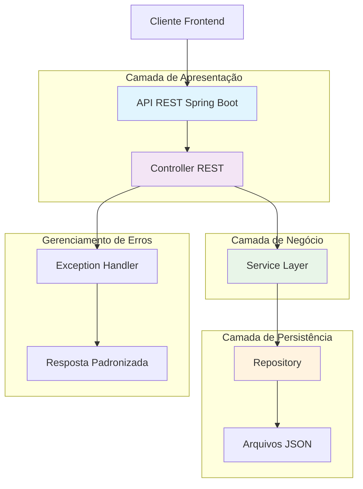

#  API Mercado Livre - Detalhes de Itens

[](https://java.com)
[](https://spring.io/projects/spring-boot)
[](LICENSE)

API RESTful inspirada no Mercado Livre para gerenciamento de detalhes de produtos, com operações CRUD completas e persistência em JSON.

## 🎯 Funcionalidades

- ✅ **CRUD Completo** - Create, Read, Update, Delete de itens
- ✅ **Persistência em JSON** - Dados salvos em arquivo sem necessidade de banco
- ✅ **Tratamento de Erros** - Respostas padronizadas para todos os cenários
- ✅ **Validações** - Verificação de dados de entrada
- ✅ **Documentação Automática** - Endpoint raiz com guia de uso

## 🏗️ Arquitetura da Aplicação



## 📊 Modelo de Dados

### Entidade Item

```JSON
{
  "id": "MLA123456789",
  "titulo": "iPhone 13 Pro Max 256GB",
  "preco": 4500.00,
  "moeda": "BRL",
  "condicao": "novo",
  "freteGratis": true,
  "quantidadeVendida": 150,
  "quantidadeDisponivel": 25,
  "fotos": ["url1", "url2"],
  "descricao": "Descrição completa do produto...",
  "vendedor": {
    "id": 12345,
    "apelido": "seller_shop",
    "reputacao": "green",
    "totalTransacoes": 1500,
    "dataRegistro": "2020-05-15"
  }
}
```

## 🛠️ Tecnologias Utilizadas

| Tecnologia | Versão | Finalidade |
|------------|---------|------------|
| **Java** | 17 | Linguagem de programação |
| **Spring Boot** | 3.2.0 | Framework backend |
| **Maven** | 3.6+ | Gerenciamento de dependências |
| **Jackson** | 2.15 | Manipulação de JSON |
| **Lombok** | 1.18 | Redução de boilerplate |
| **JUnit** | 5 | Testes unitários |

## 📋 Endpoints Disponíveis

| Método | Endpoint | Descrição |
|--------|----------|-----------|
| `GET` | `/api/itens` | Lista todos os itens |
| `GET` | `/api/itens/{id}` | Busca item por ID |
| `POST` | `/api/itens` | Cria novo item |
| `PUT` | `/api/itens/{id}` | Atualiza item existente |
| `DELETE` | `/api/itens/{id}` | Remove item |
| `GET` | `/api/itens/{id}/descricao` | Busca apenas descrição |
| `GET` | `/api/itens/{id}/disponibilidade` | Verifica disponibilidade |

## 🔧 Configuração do Ambiente

### Pré-requisitos
- **Java 17** ou superior ([Download](https://adoptium.net/))
- **Maven 3.6+** ([Download](https://maven.apache.org/))
- **Git** ([Download](https://git-scm.com/))

### Verificações iniciais
```bash
# Verificar Java
java -version

# Verificar Maven
mvn -version

# Verificar Git
git --version
```

## 🚀 Execução Rápida

Consulte [run.md](run.md) para comandos detalhados de execução.

## 🧪 Testando a API

### Com Postman
1. Importe a coleção: `postman/MercadoLivre-API.postman_collection.json`


## 📝 Estrutura do Projeto

```
src/main/java/com/aparecida/mercadoLivre/
├── MercadoLivreApplication.java     # Classe principal
├── controller/                      # Endpoints REST
│   └── ItemController.java
├── service/                         # Lógica de negócio
│   └── ItemService.java
├── repository/                      # Acesso a dados
│   └── ItemRepository.java
├── model/                           # Entidades
│   ├── Item.java
│   ├── Vendedor.java
│   └── RespostaErro.java
└── exception/                       # Tratamento de erros
    ├── ItemNaoEncontradoException.java
    └── ManipuladorExcecoes.java
```

